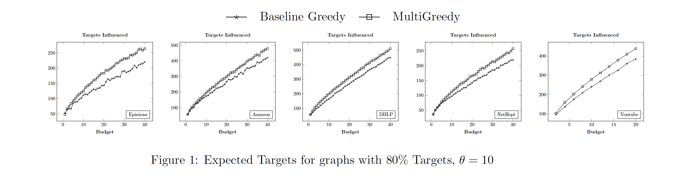

# Targeted Influence Maximization

In social networks, it is often the case that we need to spread ideas and influence through the network. For this to succeed, individual nodes with high influence should be identified so as to maximize the influence spread. This is the Influence Maximization problem. In Targeted Influence Maximization, we want to find influential nodes that maximize the influence to one set of "Target" users, while maintaining the number of "Non Targets" influenced below a threshold number. In this repository we study various algorithms to solve this problem.


# Results


To see additional results, click [here](experiment-results/experiment-results.pdf).

# How to Compile
We recommend using GCC 4.9 and greater.
1. Set the compiler path for CXX in Makefile
2. Make the influence target:
    ```
    make influence
    ```
This will make an executable named "influence".
# How to run
Create a folder with the name "results". Store the graph file,labels file in the graphs folder. The graph file has the following format:
```
First line: <number of node> <number of edges>
From second line: <from node> <to node>
```

The labels file name has the following format:
```
Name of the file: <Graph name>_<percentage>_labels.txt
Example: epinions.txt_0.70_labels.txt
```
The labels file hase the following format. Here if the node is a target, label it "A". Otherwise, label it B
```
First line: # A comment describing the labels selection
From second line: <nodeId> <A or B>
```

Set the following Parameters:
1. algorithm - "baseline" for Natural Greedy, "timtim" for Multi Greedy
2. percentage - The percentage of targets. eg: 70 for 70% Targets
3. budget - Set the seed set size
4. threshold - set the non targets threshold
5. model - "IC" for Independent Cascade Model (default), "LT" for Linear Threshold model. 

Example command:
```
./influence --algorithm baseline --graph epinions.txt --percentage 80 --budget 20 --threshold 10
```
The above command will execute the baseline greedy algorithm on Epinions, and produce a seed set of size 20. The output is stored in the "results" folder as a JSON file. It has the following keys and values:

1. "bestSeedSet" - This is the seed set produced.
2. "expectedTargets" - The expected number of targets influenced.
3. "expectedNonTargets" - The expected number of non targets influenced.


# Download Graph Data
The graphs that we have used, along with labels file can be downloaded [here](https://www.dropbox.com/s/qqr4a5k0irx7kgh/graph_data.zip?dl=0&raw=true). Unzip them and place all files in graphs folder before running the program.

